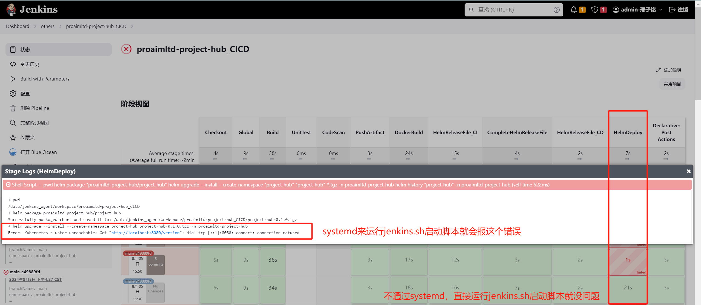
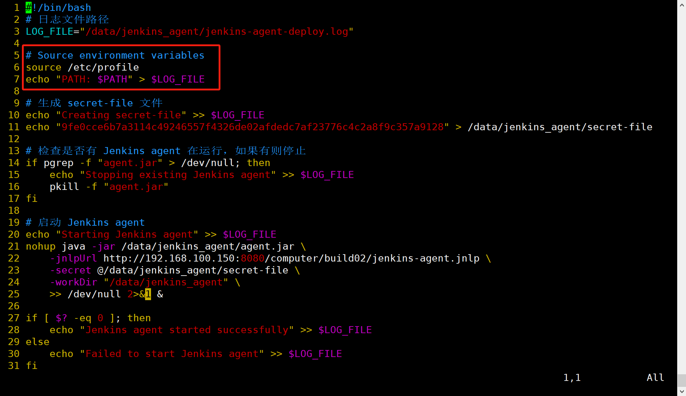
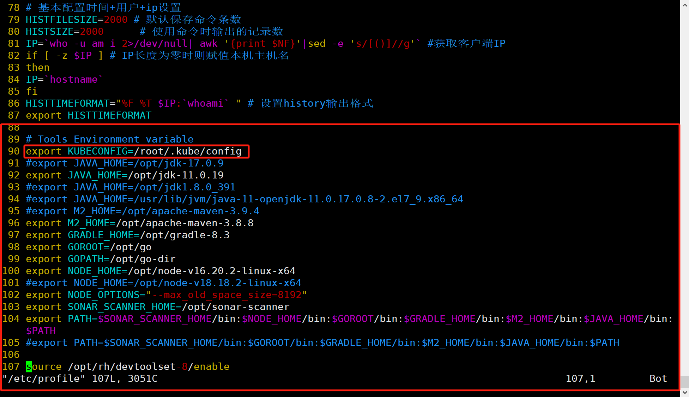
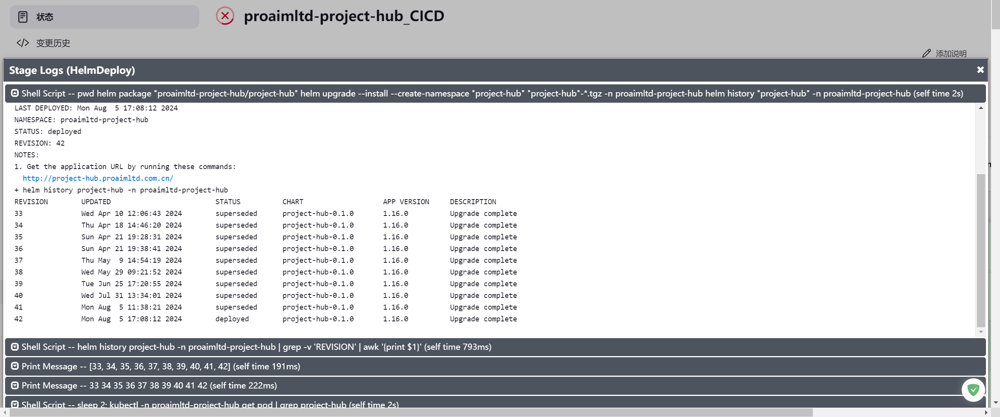
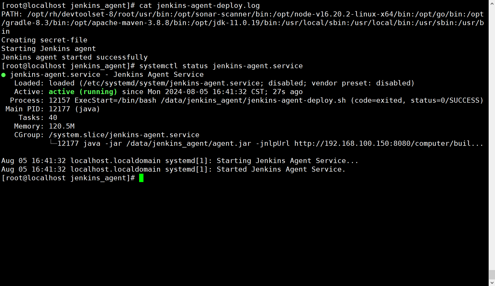

# Systemd运行Jenkins Slave脚本导致环境变量不生效或部分二进制工具关联的授权文件找不到等异常问题的解决心得

- 1、Helm程序是由Golang研发，作者制作的一个二进制可执行程序，无需配置环境变量，解压至 /usr/local/bin 目录下开箱即用，与kubectl客户端二进制程序同理。
- 2、Systemd与Shell环境区别：
  - 当你在命令行中手动运行一个脚本时，这个脚本会继承你当前 shell 会话的环境变量。也就是说，你在 shell 配置文件（如 /etc/profile、~/.bashrc、~/.bash_profile 等）中设置的环境变量会自动被继承。
  - 而 systemd 启动的服务不会继承 shell 的环境变量。systemd 有自己的运行环境，并且默认不会读取你的 shell 配置文件。因此，如果你没有在 systemd 服务文件中显式声明环境变量，它们就不会被 systemd 启动的服务继承。
- 3、所有我选择了在 /etc/profile 统一管理所有环境变量，为所有用户和登录 shell 会话提供的全局配置文件。
  但是，systemd 服务启动的进程并不是通过一个登录 shell 会话启动的，所以它不会自动读取 /etc/profile。
- 4、systemd 的环境变量：
  - systemd 服务文件有一个 [Service] 部分，可以通过 Environment= 指令来设置环境变量。这些变量只在 systemd 管理的服务中生效。
  - 如果你希望 systemd 服务也能使用你的环境变量（例如 KUBECONFIG），你需要在服务文件中显式声明这些变量，或者在启动脚本中设置它们，如：在启动脚本中增加 source /etc/profile。
- 5、为什么需要显式声明 KUBECONFIG：
  - 当你在命令行中运行 Helm 时，它可以通过继承的环境变量知道 KUBECONFIG 的位置。
  - 而 systemd 启动的 Jenkins Slave 进程没有从 shell 会话中继承 KUBECONFIG，因此 Helm 找不到默认的 kubeconfig 文件。
  - 通过显式声明 KUBECONFIG 环境变量，你可以确保无论是在手动运行脚本还是通过 systemd 启动服务时，Helm 都能找到正确的配置文件，因此我在 /etc/profile 中增加了：export KUBECONFIG=/root/.kube/config
- vim /etc/profile

```bash
# Tools Environment variable
export KUBECONFIG=/root/.kube/config
#export JAVA_HOME=/opt/jdk-17.0.9
export JAVA_HOME=/opt/jdk-11.0.19
#export JAVA_HOME=/opt/jdk1.8.0_391
#export JAVA_HOME=/usr/lib/jvm/java-11-openjdk-11.0.17.0.8-2.el7_9.x86_64
#export M2_HOME=/opt/apache-maven-3.9.4
export M2_HOME=/opt/apache-maven-3.8.8
export GRADLE_HOME=/opt/gradle-8.3
export GOROOT=/opt/go
export GOPATH=/opt/go-dir
export NODE_HOME=/opt/node-v16.20.2-linux-x64
#export NODE_HOME=/opt/node-v18.18.2-linux-x64
export NODE_OPTIONS="--max_old_space_size=8192"
export SONAR_SCANNER_HOME=/opt/sonar-scanner
export PATH=$SONAR_SCANNER_HOME/bin:$NODE_HOME/bin:$GOROOT/bin:$GRADLE_HOME/bin:$M2_HOME/bin:$JAVA_HOME/bin:$PATH
#export PATH=$SONAR_SCANNER_HOME/bin:$GOROOT/bin:$GRADLE_HOME/bin:$M2_HOME/bin:$JAVA_HOME/bin:$PATH

source /opt/rh/devtoolset-8/enable
```

- vim /etc/systemd/system/jenkins-agent.service

```bash
[Unit]
Description=Jenkins Agent Service
After=network.target

[Service]
Type=forking
ExecStart=/bin/bash /data/jenkins_agent/jenkins-agent-deploy.sh
Restart=on-failure
RestartSec=5s
StartLimitInterval=0

[Install]
WantedBy=multi-user.target
```

- vim /data/jenkins_agent/jenkins-agent-deploy.sh

```bash
#!/bin/bash
# 日志文件路径
LOG_FILE="/data/jenkins_agent/jenkins-agent-deploy.log"

# Source environment variables
source /etc/profile
echo "PATH: $PATH" > $LOG_FILE

# 生成 secret-file 文件
echo "Creating secret-file" >> $LOG_FILE
echo "9fe0cce6b7a3114c49246557f4326de0******************" > /data/jenkins_agent/secret-file

# 检查是否有 Jenkins agent 在运行，如果有则停止
if pgrep -f "agent.jar" > /dev/null; then
    echo "Stopping existing Jenkins agent" >> $LOG_FILE
    pkill -f "agent.jar"
fi

# 启动 Jenkins agent
echo "Starting Jenkins agent" >> $LOG_FILE
nohup java -jar /data/jenkins_agent/agent.jar \
    -jnlpUrl http://192.168.100.150:8080/computer/build02/jenkins-agent.jnlp \
    -secret @/data/jenkins_agent/secret-file \
    -workDir "/data/jenkins_agent" \
    >> /dev/null 2>&1 &

if [ $? -eq 0 ]; then
    echo "Jenkins agent started successfully" >> $LOG_FILE
else
    echo "Failed to start Jenkins agent" >> $LOG_FILE
fi
```


- Systemd运行Jenkins Slave脚本导致环境变量不生效或部分二进制工具关联的授权文件找不到等异常问题截图



- Systemd管理Jenkins Slave启动脚本，实现开机自启动Jenkins Slave


- Systemd管理Jenkins Slave启动脚本关键配置项




- 问题解决成功截图





